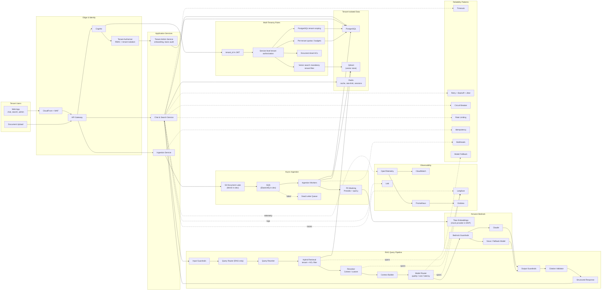

# MVP Scoping Document — ContextForge

`docs/arch.md` = target-state architecture. This doc = what ships in MVP vs later.

## Goal

Prove core loop: tenant uploads docs → ingested → user chats/searches → grounded, cited answer. Multi-tenant isolation from day one (hard to retrofit). Everything else deferred.

## In Scope (MVP)

| Area | Included |
|---|---|
| Clients | Web App (chat, search, basic admin), Document Upload |
| Edge/Identity | CloudFront+WAF, API Gateway, Cognito, Tenant Authorizer |
| App Services | Chat & Search Service, Ingestion Service, minimal Tenant Admin Service |
| Async Ingestion | S3 Document Lake (MinIO in dev), SQS (ElasticMQ in dev), Ingestion Workers (parse→**PII mask**→chunk→embed→index), DLQ |
| AI | Embeddings via a swappable provider (mock/`FakeEmbeddings` implemented now; Bedrock Titan deferred, see `app/core/embeddings.py`), LLM(s) via Bedrock (Claude + Nova fallback) — not yet built, PII masking via Presidio/spaCy at ingestion time (implemented) |
| Data | PostgreSQL (tenants/users/docs/ACL/jobs), **Qdrant** (vector store — decided, resolves the open risk below), Redis (session+rate-limit+cache) |
| RAG Pipeline | Input Guardrails, Query Router (RAG-only, no tool/direct branch), Query Rewriter, Retrieval (vector+ACL filter), Reranker (Cohere/custom), Context Builder, Model Router (quality/cost/latency), Output Guardrails, Citation Validator |
| Observability | Langfuse (traces/evals), CloudWatch, Prometheus + Grafana, Loki |
| Reliability | Timeouts, Retry+Backoff, Idempotency (ingestion), Circuit Breaker, Bulkheads, Rate Limiting, Model Fallback |
| Multi-tenancy | tenant_id in JWT, service-level authz, DB scoping, vector tenant filter, doc-level ACL, per-tenant quotas/budgets enforced |

## Out of Scope (Phase 2+)

- **Connectors**: SharePoint, Confluence, Google Drive, S3, Jira sync — MVP is manual upload only
- **Direct/tool-call intent branch in Router** — RAG-only responses

## Open Risks

- Reranker + Model Router + full reliability suite (circuit breaker/bulkheads) add real build time — biggest scope risk to MVP timeline, watch closely
- No connector sync means demo/pilot tenants must hand-upload docs
- Quota enforcement at MVP adds an extra guard path in Chat/Ingest — verify it doesn't block legit early pilot usage (soft-limit + alert before hard block)
- PII masking uses spaCy's small English model (`en_core_web_sm`, chosen to keep the worker image size down) — lower recall on names/addresses than Presidio's default `en_core_web_lg`; revisit if manual review finds it's letting real PII through
- Real Bedrock embeddings are deferred (`app/core/embeddings.py` raises `NotImplementedError`) — `langchain-aws` pins a newer `botocore` than `aioboto3` tolerates; resolve that version conflict before wiring up real embeddings

## MVP Architecture (subset of docs/arch.md)

